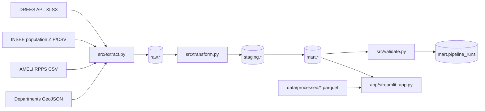
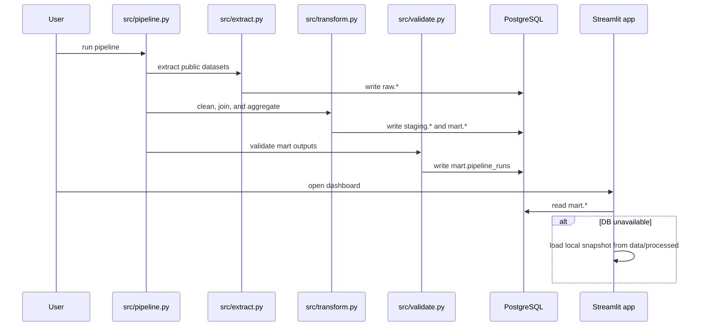
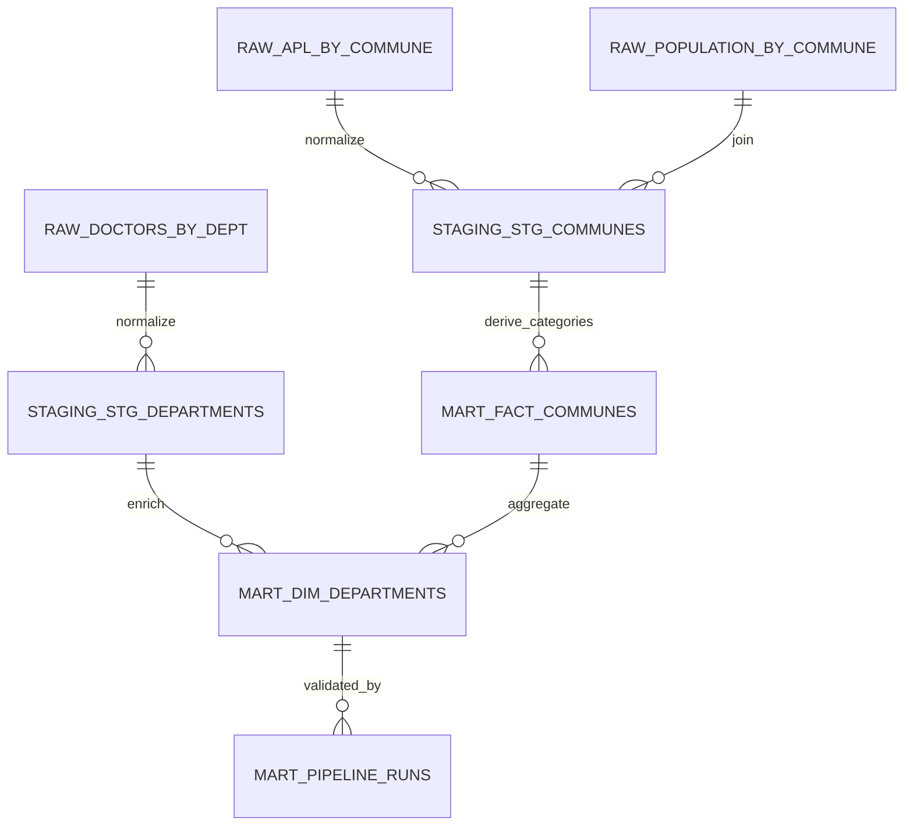
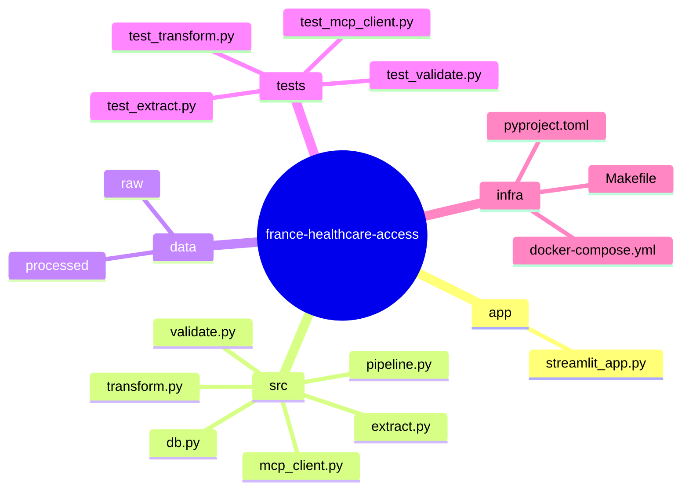

# France Healthcare Access

Portfolio-ready data pipeline and dashboard for exploring access to primary care in France through commune-level APL, population coverage, and department-level medical supply.

## Project goal

This project answers a practical policy question:

**Where is access to general practitioners most fragile, how many people are affected, and how severe is the gap?**

The product was intentionally redesigned to reduce ambiguity:

- hierarchical filters by region and department
- clearer metric labels and contextual explanations
- charts focused on distance to threshold rather than noisy rank-only views
- a local fallback mode so the dashboard still opens without PostgreSQL, using snapshots stored in `data/processed`

---

## What the dashboard shows

### Core metrics

- **Median APL**: median `accessibilité potentielle localisée` for the current selection.
- **APL gap to threshold**: difference between median APL and the selected alert threshold.
  - value `< 0`: below threshold
  - value `= 0`: exactly at threshold
  - value `> 0`: above threshold
- **% of communes below threshold**: share of communes where `APL < threshold`.
- **Population affected**: total population living in communes below threshold.
- **Critical communes**: communes where `APL < 1.5`.

### Interface sections

1. **Overview**
   - choropleth map
   - executive summary
   - departments closest to or below the threshold
   - distribution of communes by access level

2. **Compare**
   - department-to-department comparison by metric
   - default view uses **APL gap to threshold**, which is more informative than `% below threshold` when the distribution is highly compressed

3. **Department focus**
   - single-department diagnostic
   - benchmark against France and against the selected threshold
   - internal composition by access category

---

## Data sources

- **DREES APL**: commune-level localized potential accessibility
- **INSEE RP2021**: commune-level population
- **AMELI / RPPS**: physician counts by department
- **France GeoJSON**: simplified department geometry for mapping

---

## Architecture



### Operational flow



---

## Data model

### Logical schema



### Main tables

#### `raw.apl_by_commune`

Raw landing table for the DREES APL dataset.

Expected fields:

- commune code
- APL value
- department code
- region code
- `_extracted_at`

#### `raw.population_by_commune`

Raw landing table for commune population from INSEE.

Expected fields:

- commune code
- population
- `_extracted_at`

#### `raw.doctors_by_dept`

Raw landing table for physician counts by department.

Expected fields:

- department code
- physician count
- `_extracted_at`

#### `staging.stg_communes`

Normalized commune-level staging table.

Fields:

- `codgeo`
- `apl_mg`
- `dept`
- `reg`
- `population`

#### `staging.stg_departments`

Normalized department-level staging table.

Fields:

- `dept`
- `nb_medecins`

#### `mart.fact_communes`

Main analytical fact table at commune level.

Fields:

- `codgeo`
- `dept`
- `reg`
- `apl_mg`
- `population`
- `apl_category`
- `is_desert`

#### `mart.dim_departments`

Analytical aggregate at department level.

Fields:

- `dept`
- `nb_communes`
- `total_population`
- `apl_median`
- `apl_min`
- `apl_max`
- `nb_desert`
- `pct_desert`
- `nb_critical`
- `nb_medecins`
- `doctors_per_10k`

#### `mart.pipeline_runs`

Pipeline execution history and validation summary.

Fields:

- `run_id`
- `started_at`
- `completed_at`
- `status`
- `nb_communes`
- `nb_departments`
- `errors`
- `warnings`

---

## Business rules

### APL classification

```text
critical_desert : 0.0 <= APL < 1.5
under_served    : 1.5 <= APL < 2.5
adequate        : 2.5 <= APL < 4.0
well_served     : 4.0 <= APL
```

### Operational threshold

The dashboard default is:

```text
APL_THRESHOLD = 2.5
```

The user can adjust that threshold in the interface. The app recalculates:

- `% of communes below threshold`
- `nb_desert`
- `pop_desert`
- `apl_gap`

without modifying the underlying mart tables.

---

## Quality and validation

Checks implemented in [src/validate.py](src/validate.py) cover:

- duplicate `codgeo` keys
- APL values outside the `[0, 200]` range
- unexpected APL categories
- minimum commune count
- plausible department count
- plausible total population range
- plausible national median APL range
- consistency of the most affected department

Current repository snapshot in [data/processed/quality_report.json](data/processed/quality_report.json):

- 35,000 communes
- 96 departments
- 1.0% of communes below the default threshold
- 1,357,780 people living in communes below threshold
- national median APL of 3.5

---

## Repository structure



---

## Run locally

### 1. Install dependencies

```bash
uv sync
```

### 2. Start PostgreSQL

```bash
docker compose up -d
```

> The project uses port `5433` by default, not `5432`.

### 3. Run the pipeline

```bash
uv run python src/pipeline.py
```

### 4. Launch the dashboard

```bash
uv run streamlit run app/streamlit_app.py
```

---

## Dashboard fallback mode

If PostgreSQL is unavailable, the dashboard attempts to load:

- `data/processed/communes_enriched.parquet`
- `data/processed/departements_summary.parquet`
- `data/processed/quality_report.json`

This makes it possible to:

- validate the UX without a running database
- demo the product quickly
- keep a stable portfolio presentation mode

---

## Useful commands

### Tests

```bash
uv run pytest -q
```

### Lint

```bash
uv run ruff check src app tests
```

### App

```bash
uv run streamlit run app/streamlit_app.py
```

---

## Dashboard design choices

### What was simplified

- overly dense visual layers were removed
- weak ranking charts were replaced with **APL gap to threshold** views
- hierarchical filters replaced long unreadable department lists
- department names are shown alongside codes for clarity
- metric explanations were embedded in the app itself

### Why `% below threshold` can be misleading on its own

When nearly all departments sit at `0%` and only one or two concentrate the problem, a pure ranking chart generates noise rather than insight. For that reason, the dashboard now prioritizes:

- `Median APL`
- `APL gap to threshold`
- benchmark versus France
- short textual risk interpretation

---

## Current limitations

- the dashboard depends on the quality of public sources at extraction time
- automatic raw-column detection is resilient but still assumes plausible headers
- local snapshots in `data/processed` are intended for demo and fallback, not for live monitoring
- the project evaluates access through APL and aggregated supply, so it does not replace detailed territorial, clinical, or operational analysis

---

## Suggested next improvements

- add time series if historical sources become available
- enrich regional and departmental metadata with additional official reference tables
- support CSV or PNG export from the dashboard
- add lightweight UI consistency tests
- publish a more detailed field-level data dictionary

---

## Key files

- [app/streamlit_app.py](app/streamlit_app.py)
- [src/pipeline.py](src/pipeline.py)
- [src/extract.py](src/extract.py)
- [src/transform.py](src/transform.py)
- [src/validate.py](src/validate.py)
- [docker-compose.yml](docker-compose.yml)
- [pyproject.toml](pyproject.toml)
